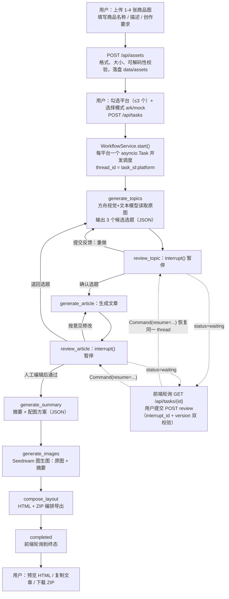

## 1. 是否使用了子图？——没有

先明确概念：LangGraph 里的**子图（subgraph）**是指把一个 `compile()` 后的图作为另一个图的节点（嵌套图）。我在整个项目里搜索过，只有一处 `StateGraph` 定义，位于 [workflow.py](file:///c:/Users/yuhang.meng/Desktop/Documents/上传图文-图文生成/app/workflow.py#L66)：

```python
graph = StateGraph(ContentState)
```

全项目**只有一个扁平的 7 节点图**，没有任何"图嵌套图"的结构。

那 [architecture.md](file:///c:/Users/yuhang.meng/Desktop/Documents/上传图文-图文生成/docs/architecture.md) 里画的"小红书 StateGraph / 公众号 StateGraph / X StateGraph"是什么？这是**文档措辞容易误导的地方**——它其实指的不是三个子图，而是**同一个编译好的图实例，被三个平台用不同的 `thread_id` 复用**：

- `thread_id = f'{task_id}:{platform}'` → 每个平台一条独立的 checkpoint 线程，互不覆盖
- `WorkflowService.schedule()` 为每个平台创建一个 `asyncio.Task`，配合 `Semaphore(3)` 限流 → 平台之间并发执行，一个平台卡在人工审核时不会阻塞其他平台

这是"**多线程（multi-thread）并发**"而不是"多子图"。如果面试被追问，这是一个很好的区分点：项目选择了更轻的方案（单图 + thread 隔离），而不是把每个平台拆成子图再组合。

### 流程图（从用户操作开始）



关键机制补充：两个 `review_*` 节点不挂静态出边，而是由 `interrupt()` 挂起后，通过 `Command(update=..., goto=...)` 决定下一跳；后端提交 `Command(resume={interrupt_id: decision})` 恢复同一 `thread_id`，状态由 `InMemorySaver` 保存。

---

## 2. 前端是 React 还是 Vue？——都不是

是**原生 JavaScript（ES Module），零框架、零构建**。证据：

- [index.html](file:///c:/Users/yuhang.meng/Desktop/Documents/上传图文-图文生成/web/index.html) 直接 `<script type="module" src="/static/app.js">`，没有 React/Vue CDN、没有打包产物
- [app.js](file:///c:/Users/yuhang.meng/Desktop/Documents/上传图文-图文生成/web/app.js) 全部是 `document.querySelector` + 模板字符串 + `innerHTML` 手动渲染，连 `package.json` 都不存在
- README 明确写了技术栈是"原生 JavaScript/CSS……无需 Node 构建"

这是个**刻意的架构取舍**：本地单人工作台，引入 React/Vue 构建链只会增加部署复杂度（需要 npm install、打包、CI），收益为零。文档里也预留了升级路径。

---

## 3. 简历项目经历（可直接使用）

> **图文工坊 · 多平台 AI 图文生成工作台**（个人项目 / 独立设计与实现）
>
> **一句话**：基于 FastAPI + LangGraph 构建的营销内容生产流水线，把「上传商品素材 → AI 选题 → 人工审核 → 摘要提炼 → AI 生图 → 图文编排导出」做成可中断、可恢复、多平台并发的自动化工作流。
>
> **技术栈**：Python 3.13 · FastAPI · LangGraph（StateGraph / interrupt / Command / Checkpointer）· 火山方舟多模态与生图 API · asyncio · Pydantic · 原生 JS（零构建）· pytest

**核心设计与技术亮点**

1. **Human-in-the-loop 状态机**：用 LangGraph 编排 7 节点有向图，在选题、文章两处设置 `interrupt()` 人工断点，`Command(resume)` 精确恢复同一线程；审核等待期间不占用执行资源，多平台可持续并发推进。
2. **多平台并发与状态隔离**：一份编译图实例服务 3 个平台，以 `thread_id = task_id:platform` 做 Checkpoint 隔离；`asyncio.Semaphore(3)` 限流 + 分支级 `Lock` 串行化同分支审核；采用"先同步置位状态、再创建任务"的写法，从调度层根除重复点击导致的双重执行。
3. **数据一致性防线**：`interrupt_id + version` 双因子校验，过期/重复审核一律 409 拦截；上游选题或文章变更时**级联清空**下游摘要、图片、导出产物，杜绝旧内容污染成品；审核历史全量留痕（含被审核原文）并设 40 次上限防滥用。
4. **LLM 工程化实践**：Provider 抽象出真实（ArkProvider）与演示（MockProvider）双通道，真实接口失败绝不静默降级；LLM 的 JSON 输出经 Pydantic 严格结构化校验（如候选选题必须恰好 3 条、字段长度约束）；错误统一脱敏（API Key → `[REDACTED]`）并按 401/403/404/429 映射为可读提示。
5. **安全与边界控制**：同源中间件拦截跨站写请求（防 CSRF）、前端统一 HTML 转义防 XSS、密钥仅存服务端 `.env`；图片二进制不进 Graph State，只存素材引用，控制状态体积与序列化成本。
6. **质量保障**：pytest 覆盖三平台全流程、并发调度、过期/重复审核拦截、失败节点原地重试、上传校验、HTML 转义、跨站拦截等 10 个用例；另附真实模型契约冒烟脚本，验证原图与摘要确实传入方舟接口。

**架构取舍（体现工程判断力）**：明确本地原型边界——刻意不引入 React 构建链、数据库、Redis、Docker；同时文档化升级路径（`InMemorySaver` → `PostgresSaver`、内存仓库 → PostgreSQL、外部任务队列、对象存储、多租户权限、供应商侧幂等）。可量化：7 节点 / 2 个人工断点 / 3 平台并发 / 单任务 ≤4 图 8MB / 10 个测试用例。

---

简历的措辞我刻意没有编造"性能提升 X%"这类无法验证的数据，全部亮点都能在代码里指出来源——面试官追问任何一条，你都能打开对应文件讲实现细节，这比虚指标更有说服力。如果你想把它存成文件，告诉我路径即可（当前会话是只读模式，我可以生成文件内容供你创建）。
