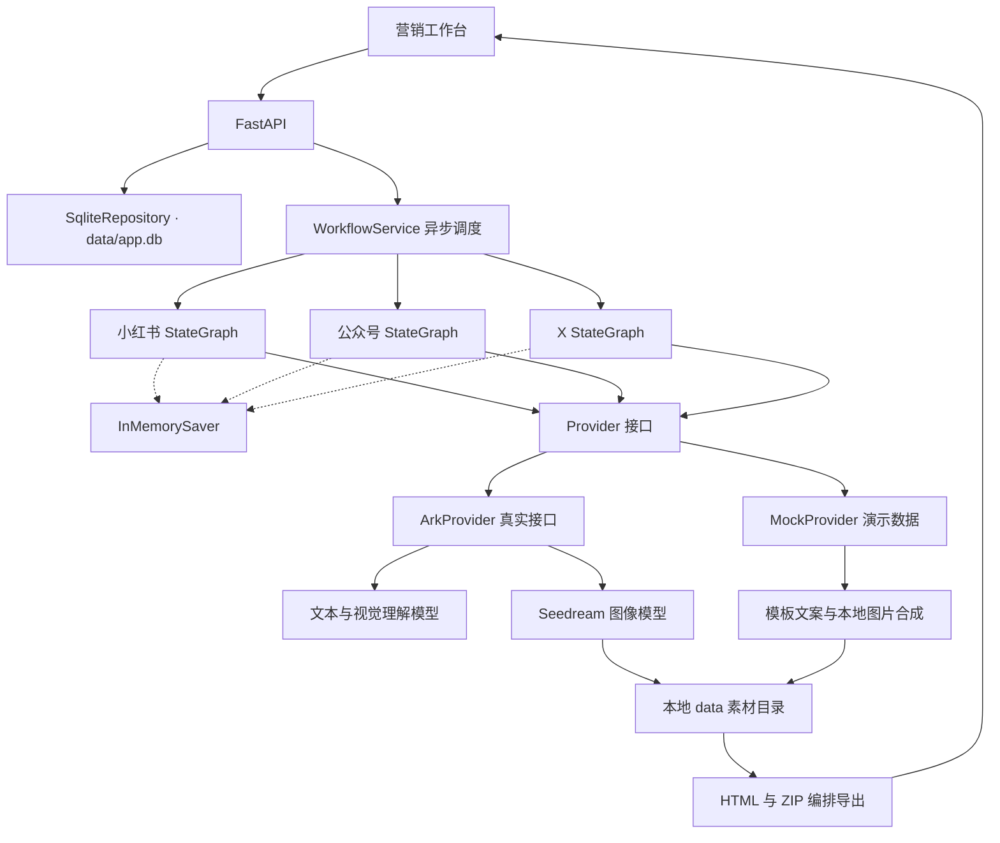
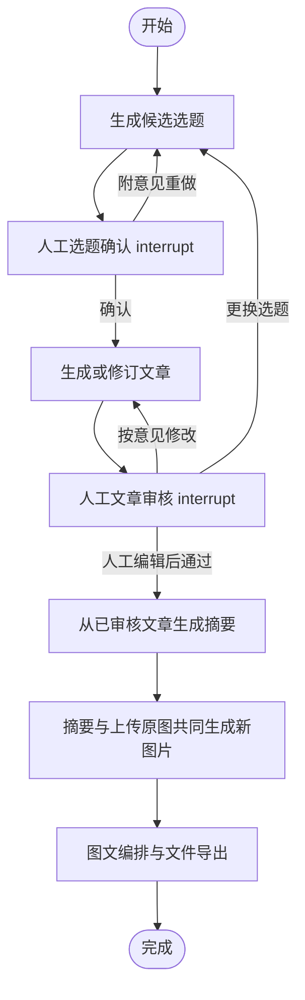

# 实际实现架构

本地版本为每个平台创建独立的 LangGraph 执行线程。API 的调度服务负责按所选平台分发，避免一个平台等待审核时阻塞其他平台。工作流不是前端模拟的步骤跳转。

## 实际 LangGraph 节点

`review_topic` 和 `review_article` 通过 `Command(update=..., goto=...)` 决定下一节点，不额外添加静态出边。后端提交 `Command(resume={interrupt_id: decision})` 恢复相同 `thread_id`。

## 状态和审核

- `thread_id = task_id:platform`，不同平台互不覆盖。
- 节点完成后由 Checkpointer 记录工作流状态；业务仓库记录界面投影和审核历史。
- 审核提交必须匹配 interrupt ID 和版本；未处于 waiting 状态的重复提交返回 HTTP 409。
- 选题重做或文章修订会清空下游摘要、图片和导出引用，防止过期内容出现在成品。
- 员工在编辑器中最终确认的正文写入 `approved_article`，摘要与导出使用同一正文。
- 图片二进制不写入 Graph State，只保存素材 ID 和生成图片引用。
- 失败后使用相同线程、`input=None` 恢复失败节点，不重新执行此前已完成的摘要与审核节点。

## API

| 接口 | 用途 |
|---|---|
| `GET /api/config` | 平台配置、模型名称、示例素材，不返回密钥 |
| `POST /api/assets` | 上传并校验商品图片 |
| `POST /api/tasks` | 创建任务并并行调度平台工作流 |
| `GET /api/tasks` | 创作记录 |
| `GET /api/tasks/{id}` | 状态、审核暂停点、文章和成品 |
| `POST /api/tasks/{id}/{platform}/review` | 选题确认、文章审核、修改或退回 |
| `POST /api/tasks/{id}/{platform}/retry` | 从失败节点重试 |
| `GET /media/exports/*` | 获取已生成 HTML 或 ZIP |

## 持久化与升级路径

当前使用 SQLite 单文件持久化：业务数据在 `data/app.db`（SqliteRepository），LangGraph 断点在 `data/checkpoints.db`（AsyncSqliteSaver），媒体文件仍在 `data/` 目录。单进程部署即可，备份只需复制 `data/`。进程重启时运行中的分支被标记为“需重试”，重试会从最后一个完成的节点继续，不会重复已完成的付费步骤。

扩展到多实例或对外开放时，把仓库升级为 PostgreSQL、Checkpointer 换成 PostgresSaver，并使用外部任务队列、对象存储和身份权限体系；需要为不同租户建立隔离，并对失败后的重复生图增加供应商侧幂等/状态查询机制。
